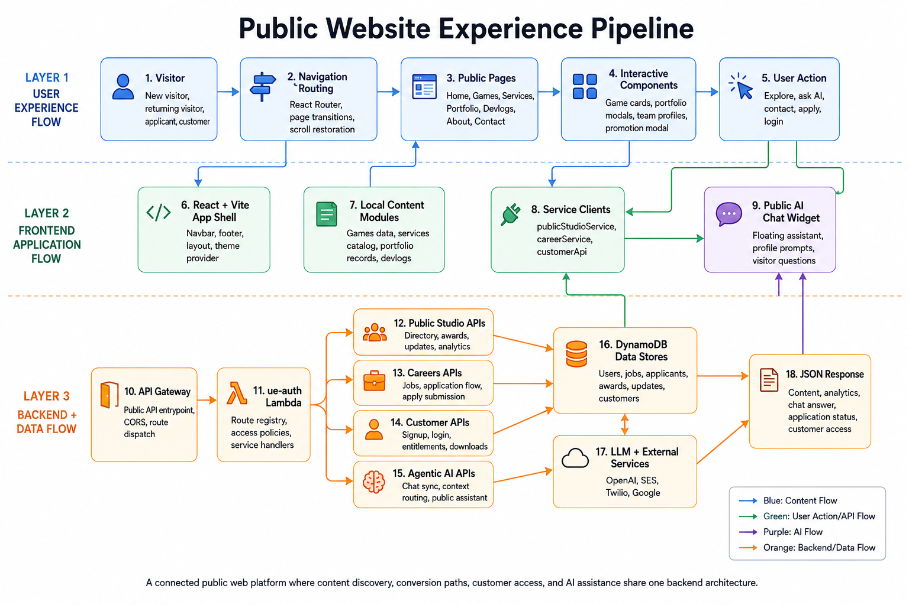

# Public Website Experience Pipeline - Website

## Summary

This diagram shows how the Fluke Games public website works as a connected discovery layer. It starts with visitor navigation, moves through React routing and page experiences, connects to frontend service clients, and then reaches backend APIs, data stores, AI services, and JSON responses.

## End-To-End Flow

1. Visitor enters the website.
2. React Router handles navigation, transitions, and scroll restoration.
3. Public pages render Home, Games, Services, Portfolio, Devlogs, About, and Contact.
4. Interactive components support cards, modals, team profiles, and promotion flows.
5. User actions trigger exploration, contact, application, login, or AI chat.
6. Frontend service clients call API Gateway and backend service routes.
7. Backend APIs return content, analytics, application state, customer state, or AI responses.

## System Components

- React + Vite app shell.
- Local content modules for games, services, portfolio, and devlogs.
- `publicStudioService`, `careerService`, and `customerApi` service clients.
- Public AI chat widget for visitor questions and guided discovery.
- API Gateway and `ue-auth` Lambda service handlers.
- Public Studio APIs, Careers APIs, Customer APIs, and Agentic AI APIs.
- DynamoDB data stores and external services such as OpenAI, SES, Twilio, and Google.

## Technology Leadership Lens

The important idea is that the public website is not only a marketing layer. It is a platform entry point that connects content discovery, conversion paths, customer access, and AI assistance to the same backend operating model.
