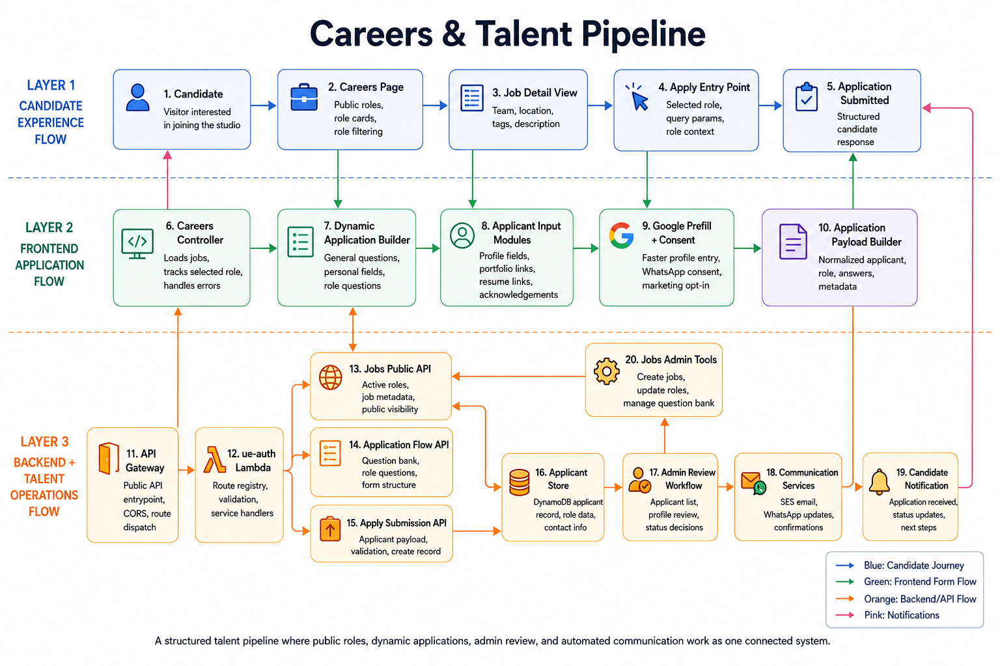

# Careers & Talent Pipeline - Website

## Summary

This diagram shows the hiring journey from candidate discovery to application submission, storage, review, and notification. It frames the careers page as a structured talent pipeline rather than a static list of roles.

## End-To-End Flow

1. Candidate views open roles on the Careers page.
2. Job detail view presents team, location, tags, and description.
3. Apply entry point carries selected role context into the application flow.
4. Dynamic application builder assembles general, personal, and role-specific questions.
5. Applicant modules collect profile data, portfolio links, resume links, acknowledgements, consent, and opt-ins.
6. Application payload builder normalizes applicant data, role data, answers, and metadata.
7. Backend APIs store applicant records and support admin review.
8. Communication services send email and WhatsApp updates.

## System Components

- Careers controller for jobs, selected role, loading, and errors.
- Dynamic form builder driven by job flow and question bank data.
- Google prefill and WhatsApp consent.
- Public Jobs API, Application Flow API, and Apply Submission API.
- DynamoDB applicant store.
- Admin review workflow and jobs admin tools.
- SES email and Twilio WhatsApp notification paths.

## Technology Leadership Lens

The careers flow creates measurable hiring infrastructure. It turns public interest into structured applicant data, supports consistent review, and gives the studio communication loops without relying on manual follow-up alone.
