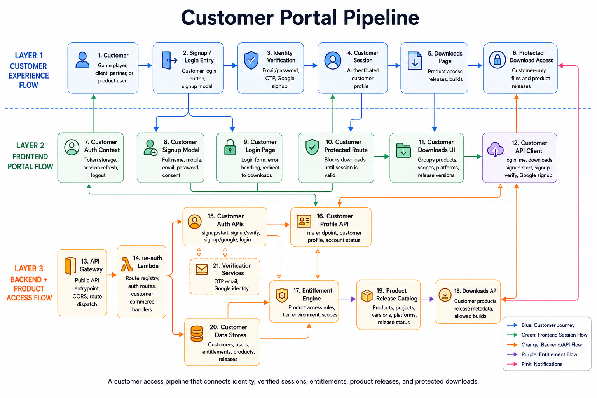

# Customer Portal Pipeline - Website

## Summary

This diagram shows how customer access moves from signup/login to verified identity, session handling, entitlement lookup, product release metadata, and protected downloads.

## End-To-End Flow

1. Customer starts from signup or login.
2. Identity verification runs through email/password, OTP, or Google signup.
3. Customer session is stored and refreshed through the auth context.
4. Protected route blocks downloads until a valid session exists.
5. Downloads UI requests customer products, scopes, platforms, and versions.
6. Backend validates profile and entitlements.
7. Product release catalog returns allowed builds and release metadata.
8. Customer receives protected download access.

## System Components

- Customer signup modal and login page.
- Customer auth context for token storage, profile refresh, and logout.
- Customer protected route.
- Customer API client for login, profile, downloads, signup start, signup verify, and Google signup.
- Customer Auth APIs, Customer Profile API, Entitlement Engine, Downloads API, and Product Release Catalog.
- Customer data stores for customers, users, entitlements, products, and releases.
- Verification services for OTP email and Google identity.

## Technology Leadership Lens

This pipeline treats product access as a governed customer capability. It makes identity, entitlement, and release access explicit, which is important when customer-only builds, paid products, or partner releases need controlled delivery.
