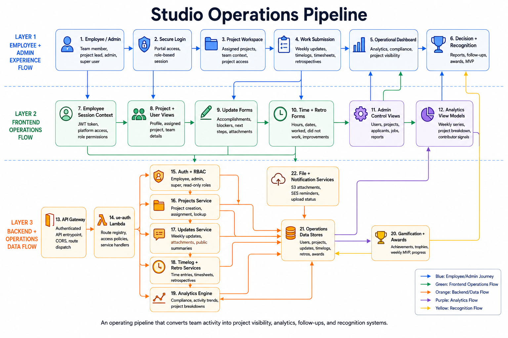

# Studio Operations Pipeline - Internal

## Summary

This diagram shows how internal studio activity becomes operational data. It connects employee/admin sessions, projects, weekly updates, timelogs, retrospectives, analytics, dashboards, and recognition.

## End-To-End Flow

1. Employee or admin logs into the portal.
2. Role-based access determines platform permissions.
3. Project workspace provides assigned project context.
4. Team members submit weekly updates, timelogs, timesheets, and retrospectives.
5. Backend services store work activity and file metadata.
6. Analytics engine builds compliance, activity, project, and contributor signals.
7. Dashboards and reports expose operational visibility.
8. Gamification and awards convert activity into recognition signals.

## System Components

- Employee session context and JWT-based platform access.
- Project and user views.
- Update forms, time forms, retro forms, and admin control views.
- Auth + RBAC, Projects Service, Updates Service, Timelog + Retro Services, Analytics Engine.
- Operations data stores for users, projects, updates, timelogs, retros, and awards.
- S3 attachment flow and SES reminder/notification support.
- Gamification + Awards service for achievements, trophies, MVP, and progress.

## Technology Leadership Lens

This pipeline is the operating layer of the studio. It helps move from informal progress tracking to measurable project visibility, risk detection, team accountability, and recognition.
