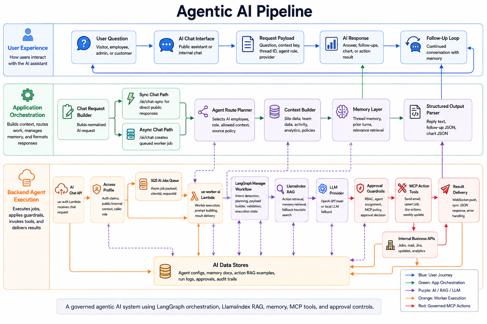

# Agentic AI Pipeline - Internal

## Summary

This diagram shows the internal agentic AI architecture. It connects chat entry points, sync and async request paths, agent routing, context building, memory, LangGraph orchestration, LlamaIndex RAG, LLM providers, approval guardrails, MCP tools, internal business APIs, and result delivery.

## End-To-End Flow

1. User submits a question through public or internal AI chat.
2. Chat request builder normalizes provider, model, context, thread, and agent fields.
3. Request travels through sync `/ai/chat-sync` or async `/ai/chat`.
4. `ue-auth` creates access profile and context metadata.
5. Async jobs move through SQS to `ue-worker-ai`.
6. Agent route planner selects AI employee, role, allowed context, and source policy.
7. Context builder loads site, team, activity, analytics, policies, and other allowed data sources.
8. Memory layer retrieves prior conversation context.
9. LangGraph Manager Workflow handles intent detection, planning, payload building, validation, and execution state.
10. LlamaIndex RAG supports action retrieval and memory retrieval with heuristic fallback.
11. LLM provider generates reasoning or structured content through OpenAI or local LLM fallback.
12. Approval guardrails validate RBAC, agent assignment, MCP policy, and approval decision.
13. MCP action tools call internal business APIs such as jobs, mail, Jira, updates, and analytics.
14. Result delivery returns WebSocket responses, sync JSON responses, errors, and run logs.

## System Components

- AI Chat API in `ue-auth`.
- SQS AI Jobs Queue.
- `ue-worker-ai` Lambda.
- Agent Route Planner and Context Builder.
- Conversation memory and AI data stores.
- LangGraph Manager Workflow.
- LlamaIndex RAG.
- OpenAI/local LLM provider fallback.
- Approval Guardrails and MCP Action Tools.
- Internal Business APIs and Result Delivery.

## Technology Leadership Lens

This architecture treats AI as a governed workflow layer, not a simple chatbot. It separates routing, context, memory, reasoning, action execution, approval, and observability so AI can support real operations while preserving control.
