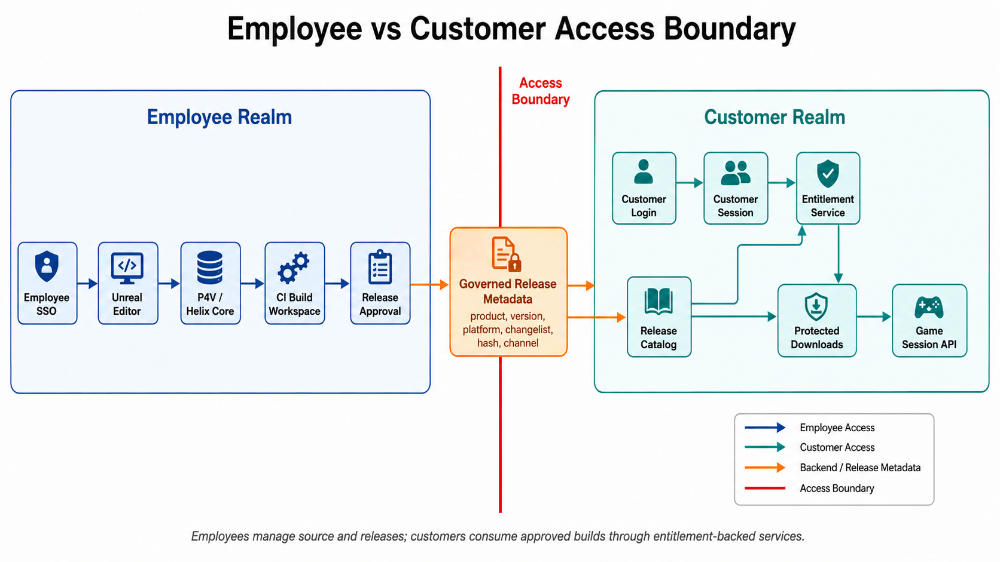

# Employee vs Customer Access Boundary

## Summary

This architecture makes the separation between employee tooling access and customer product access explicit.

## Boundary Principle

Employees should access source control, Unreal Editor, CI, admin tools, and release workflows. Customers should access only customer login, entitlements, product catalog, protected downloads, and runtime session services.

The bridge between those realms should be backend-controlled release metadata, not shared credentials or direct storage access.

## Employee Realm

- Employee SSO.
- Unreal Editor.
- P4V / Helix Core.
- CI build workspace.
- Admin backend.
- Release approval tools.

## Customer Realm

- Customer login.
- Customer session.
- Entitlement service.
- Release catalog.
- Protected downloads.
- Runtime session enablement.

## Boundary Rules

- Employee SSO tokens should not be accepted by customer-facing download or runtime services.
- Customer tokens should not grant Perforce, CI, Unreal Editor, or admin access.
- Release metadata can cross the boundary only after approval.
- Customer download access should be entitlement-backed and time-limited.
- Audit logs should record both employee release actions and customer access decisions.

## Director of Technology Lens

This diagram should show clean separation of duties. Employees create, review, package, and approve releases. Customers consume approved releases through product access controls. The bridge is governed release metadata, not shared accounts or direct infrastructure access.

## Diagram Prompt

See [prompt.md](prompt.md).
