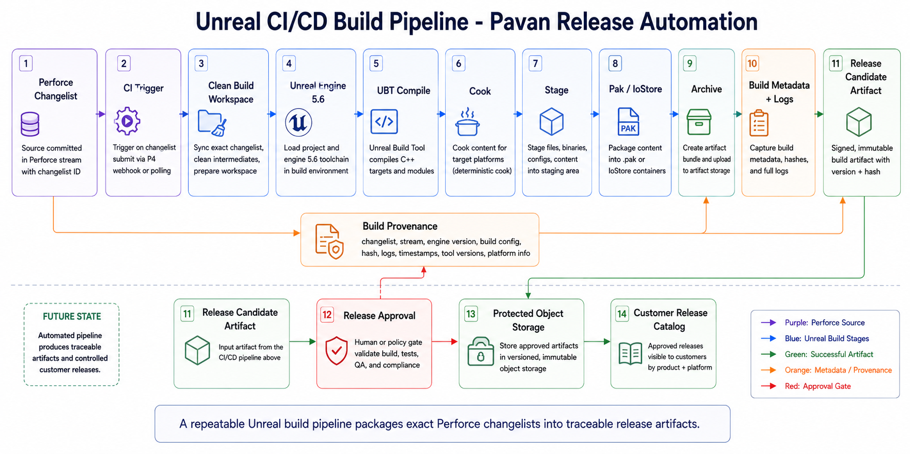

# Unreal CI/CD Build Pipeline

## Summary

This architecture converts the current manual Unreal packaging workflow into a future automated CI/CD pipeline with build provenance, artifact metadata, and release promotion.

## Current Findings

- No GitHub Actions, GitLab CI, Jenkinsfile, Azure Pipeline, Horde, TeamCity, Buildkite, or BuildGraph file was found.
- Manual packaging is documented through `RunUAT BuildCookRun`.
- Packaging settings use Pak and IoStore.
- A successful local Windows package build exists.
- Current build command uses `-noP4`, so package output is not yet tied to Perforce changelist provenance.

## Recommended Future Flow

1. Perforce submit or release-stream changelist triggers CI.
2. CI runner syncs exact changelist into a clean workspace.
3. Runner generates project files if required.
4. Runner executes UBT compile.
5. Runner executes RunUAT `BuildCookRun`.
6. Runner archives build, manifests, logs, changelist metadata, engine version, and AccessGate config.
7. Approved release is promoted to protected storage.

## Artifact Metadata

Every build should produce metadata that can be traced after release:

- Product name and project name.
- Unreal Engine version.
- Platform and build configuration.
- Perforce changelist or release label.
- Build command and CI runner identity.
- Artifact hash, manifest, logs, and archive location.
- AccessGate configuration used for the packaged build.

## Director of Technology Lens

This diagram should show the transition from a manual but proven packaging command to a repeatable release pipeline. The leadership message is provenance: every packaged build should be tied to source state, logs, approvals, and artifact metadata.

## Diagram Prompt

See [prompt.md](prompt.md).
