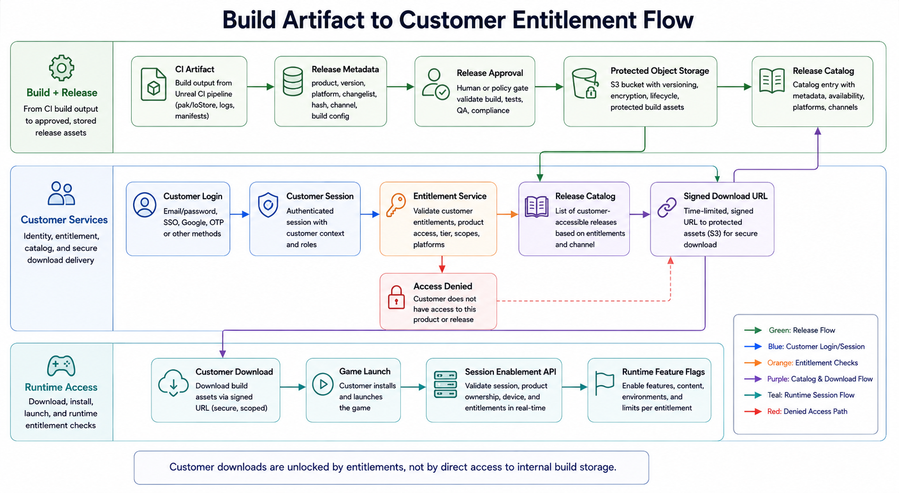

# Build Artifact to Customer Entitlement Flow

## Summary

This future-state architecture connects Unreal build artifacts to customer login, entitlement checks, release catalog visibility, protected downloads, and runtime session enablement.

## Current Findings

- No customer login service, entitlement API, release catalog, protected download service, launcher integration, or customer session enablement code was found inside the Unreal repo.
- Current AccessGate is employee/project access oriented and should not be reused as customer login.

## Future-State Flow

1. CI produces a release artifact with product, version, platform, changelist, build type, hash, and release channel.
2. Release approval promotes artifact to protected object storage.
3. Release catalog maps products and versions to customer-visible builds.
4. Customer logs in through customer account service.
5. Entitlement service checks product/license/channel access.
6. Protected download service issues short-lived signed URLs.
7. Session enablement service exchanges customer token for runtime access, feature flags, or game-session permissions.

## Required Services

- Customer identity and session service.
- Entitlement service for product, license, tier, and channel access.
- Release catalog for approved builds and visible versions.
- Protected download service that issues signed URLs instead of exposing storage directly.
- Runtime session service for feature flags, game-session permissions, or matchmaking eligibility.

## Director of Technology Lens

This diagram should make the customer boundary very clear. Customers should never touch internal Perforce, CI, or raw build storage. They only see approved builds through customer identity, entitlement, catalog, and signed-download controls.

## Diagram Prompt

See [prompt.md](prompt.md).
