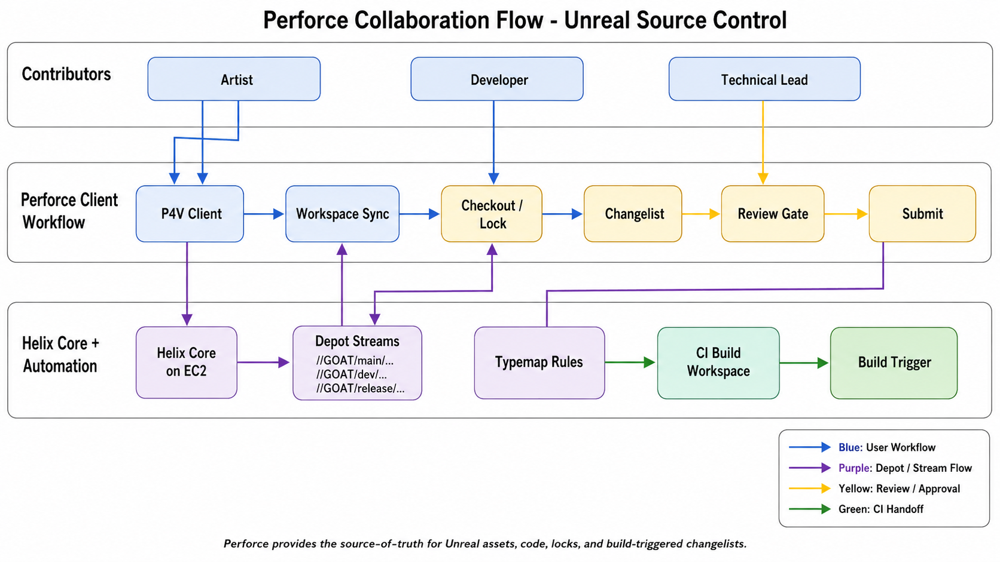

# Perforce Collaboration Flow

## Summary

This architecture covers Helix Core as the source-of-truth for Unreal source, assets, locking, changelists, and future CI-triggered builds.

## Current Findings

- Helix Core endpoint is documented as `18.216.128.9:1666`.
- Server host is documented as EC2 Ubuntu with `P4ROOT=/opt/perforce/depots`.
- SSO is enforced through an `auth-check-sso` trigger.
- Windows client helper is installed under `C:\FlukeTools\PerforceSSO`.
- `.p4ignore` excludes generated Unreal artifacts such as `Binaries`, `Builds`, `DerivedDataCache`, `Intermediate`, and `Saved`.

## Recommended Future Model

- `//GOAT/main/...` for active integration.
- `//GOAT/dev/...` or task streams for feature work.
- `//GOAT/release/...` for release stabilization.
- Dedicated CI build workspace owned by automation.
- Unreal typemap with exclusive checkout for `.uasset`, `.umap`, `.ubulk`, and `.uexp`.
- Text merge for code, configs, scripts, and docs.

## Collaboration Controls

- Content-heavy changes should require description, review, and successful editor load before submit.
- Binary Unreal assets should be lockable to avoid conflicting edits.
- CI should sync by submitted changelist and record the changelist in artifact metadata.
- Release builds should be labeled or otherwise traceable back to the exact depot state.

## Risks / Gaps

- No depot names, stream specs, workspace templates, protections table, typemap, or review tooling config were found.
- Shared Perforce user weakens auditability if not paired with strong backend SSO and server-side tracking.

## Director of Technology Lens

This diagram should make Perforce look like the governed source-of-truth for Unreal work. The important leadership story is not just storage; it is asset locking, changelist discipline, review, and build traceability.

## Diagram Prompt

See [prompt.md](prompt.md).
