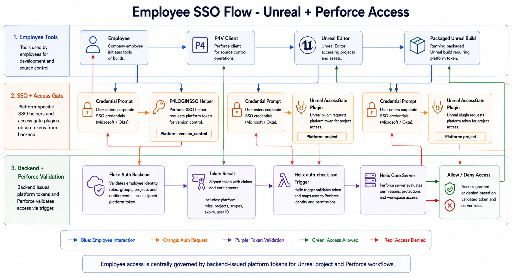

# Employee SSO Flow

## Summary

This architecture covers employee authentication for both Unreal project access and Perforce access. The current implementation is not generic OIDC; it is a Fluke backend password/token flow that returns a token-like response used by AccessGate and Perforce SSO.

## Current Flow

1. Employee opens Unreal Editor, a packaged Unreal build, or P4V.
2. Client prompts for username and password.
3. Client posts credentials and platform context to the Fluke backend auth endpoint.
4. Backend returns a token-like field.
5. Unreal AccessGate permits or blocks editor/build access based on backend response.
6. Perforce SSO helper prints the token for Helix `auth-check-sso`.
7. Helix validates token against the backend using `X-Platform: version_control`.

## Key Components

- Unreal AccessGate plugin.
- Packaged login screen configured through `DefaultGame.ini`.
- Perforce SSO helper scripts.
- Fluke backend `/auth/login`.
- Helix Core `auth-check-sso` trigger.
- Platform values such as `project` and `version_control`.

## Implementation Notes

- Unreal loads the access gate during startup and uses the backend response as the project access decision.
- Perforce uses the helper as the local credential bridge and relies on Helix server-side validation for source-control access.
- The backend token flow is shared across employee project access and version-control access, but those paths should stay policy-separated through platform context.
- Future customer login should use a separate customer identity/session model instead of this employee access gate.

## Risks / Gaps

- Unreal AccessGate appears to support remembering credentials in config; this should move to OS credential storage or token-based session handling.
- No OIDC discovery, OAuth authorization code flow, JWKS validation, refresh token handling, or local claim validation was found.
- Employee auth and future customer auth should remain separate identity realms.

## Director of Technology Lens

This diagram should communicate centralized employee access control. The strongest message is that Unreal project access and Perforce source-control access are both governed through a backend-issued token decision, while customer access remains outside this employee identity boundary.

## Diagram Prompt

See [prompt.md](prompt.md).
