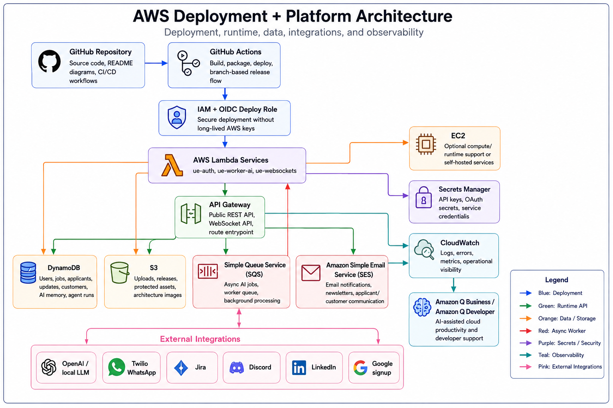

# AWS Deployment + Platform Architecture

## Summary

This diagram shows how the Fluke Games platform is deployed, secured, operated, and observed on AWS. It connects GitHub-based deployment, IAM/OIDC, Lambda services, API Gateway, DynamoDB, S3, SQS, SES, Secrets Manager, CloudWatch, EC2, Amazon Q, and external integrations.

## Deployment Flow

1. GitHub Repository stores source code, README diagrams, and CI/CD workflows.
2. GitHub Actions builds, packages, and deploys services.
3. IAM + OIDC Deploy Role allows secure deployment without long-lived AWS keys.
4. AWS Lambda Services host `ue-auth`, `ue-worker-ai`, and `ue-websockets`.

## Runtime Flow

1. API Gateway exposes REST and WebSocket entry points.
2. Lambda services execute auth, API routes, AI workers, and WebSocket delivery.
3. DynamoDB stores users, jobs, applicants, updates, customers, AI memory, and agent runs.
4. S3 stores uploads, releases, protected assets, and architecture images.
5. SQS supports async AI jobs, worker queues, and background processing.
6. SES sends email notifications, newsletters, and applicant/customer communication.
7. Secrets Manager stores API keys, OAuth secrets, and service credentials.
8. CloudWatch captures logs, errors, metrics, and operational signals.

## External Integrations

- OpenAI / local LLM.
- Twilio WhatsApp.
- Jira.
- Discord.
- LinkedIn.
- Google signup.

## Technology Leadership Lens

The AWS architecture shows how product features become an operated platform. It covers deployment, runtime execution, data persistence, async processing, secrets, observability, and external integrations in one deployment model.
